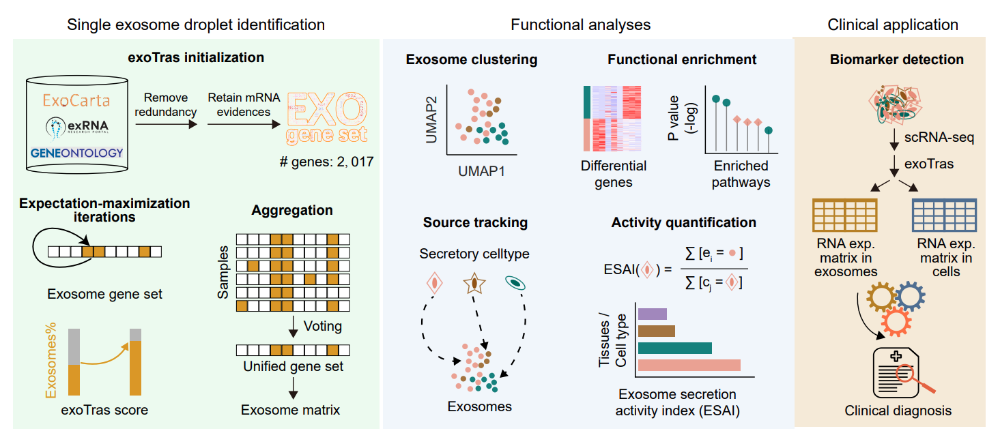

exoTras delineates exosome profiles at droplet resolution from single-cell transcriptomes
^^^^^^^^^^^^^^^^^^^^^^^^^^^^^^^^^^^^^^^^^^^^^^^^^^^^^^^^^^^^^^^^^^^^^^^^^^^^^^^^^^^^^^^^^

**exoTras** /ˈɛkoʊˌtɹeɪs/ stands for **exo**some-containing droplets identification and source **tra**cking in **s**cRNA-seq data.

You can freely use exoTras to explore exosome heterogeneity at single droplet, characterize cell type dynamics in light of exosome activity and unlock diagnostic potential of exosomes in concert with cells.

Key applications for exoTras
^^^^^^^^^^^^^^^^^^^^^^^^^^^^
- recognize exosomes at single droplet resolution
- track exosomes to orignal cell type
- calculate exosome secretion activity index (ESAI) at tissue/cell type level
- unlock exosome clinic potential

.. toctree::
   :caption: Main
   :maxdepth: 1
   :hidden:

   Overview
   Installation
   Functions

.. toctree::
   :caption: Tutorials
   :maxdepth: 1
   :hidden:

   Exosomes recognizing
   Source tracking and ESAI
